# Multirecipe :fork_and_knife:

* 이미지 기반 레시피 추천사이트
* 프로젝트 기간 : 2023/11/27~2024/01/05
* 팀원 : 강민주 김현정 이서연 표상훈

## 목차
1. [프로젝트 배경](#프로젝트-배경)
2. [서비스 소개](#서비스-소개)
3. [Tech](#Tech)
4. [프로젝트 진행개요](#프로젝트-진행개요)
5. [Workflow](#workflow)
6. [데이터 수집](#데이터-수집)
7. [데이터 전처리](#데이터-전처리)
8. [사이트 구축](#사이트-구축)
9. [모델링](#모델링)
10. [Log 데이터 수집 및 분석](#Log-데이터-수집-및-분석)
11. [Airflow](#Airflow)
12. [Model Serving](#Model-Serving)
13. [스토리보드](#스토리보드)
14. [주요기능시연영상](#주요기능시연영상)

## 프로젝트 배경 
* 2,30대 1인 가구 빠르게 증가 / 외식물가의 급격한 인상
    
생활비 절약을 위한 집밥 선호도가 증가하고 SNS나 레시피 사이트들을 통해 많은 음식레시피를 접할 수 있게 됨. 하지만 모든 레시피 컨텐츠마다 형식이 달라 혼란을 겪을 수 있음. 빠르고 편리하게 레시피 정보를 얻고 공유할 수 있는 사이트를 제작하고자 함

## 서비스 소개
#### 기본 기능 
* 로그인/ 회원가입
* 게시글 작성 
* 키워드 검색 기능 
* 카테고리별 조회 기능
* 마이페이지

#### 레시피 관련 기능 
* 게시글 최신순/조회순/별점순 정렬 
* 레시피 즐겨찾기 기능 
* 레시피 별점주기 기능

#### 이미지 기반 서비스
* 이미지 기반 레시피 검색 
* 이미지 기반 게시글 자동완성 기능

####  추천 서비스
* 취향테스트 기반 추천 서비스
* 별점기반 추천 서비스
* 로그데이터 기반 추천서비스
    * 시간대별 레시피 추천
    * 유저정보 레시피 추천

## Tech 

<div>


</div>

<div>


</div>

## 프로젝트 진행개요
* WEB
    * Django를 이용한 웹사이트 기능 구현
    * Django MYSQL 연동
    * AWS 서버에 웹사이트 배포
    * Flask 를 통해 CNN모델링과 Django 웹 연동
    * 사용자 별점 데이터를 활용한 아이템 기반 추천 모델링 완성
    * Opensearch Dashboard를 활용하여 로그 데이터 처리 및 시각화

* Modeling
    * 데이터 크롤링 및 전처리
    * 분석 기반 기능 구현 모델 선정
    * 취향 테스트 및 추천 시스템 기능 완성
    * CNN 기반 음식 사진 인식 모델링 완성
    * Airflow를 통한 DAta mart 엡데이트


## Workflow 
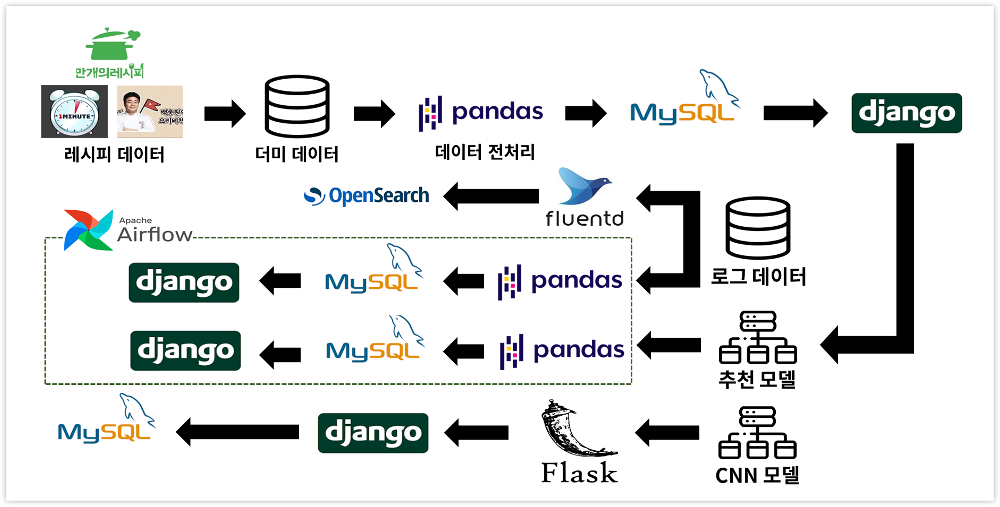

## 데이터 수집
* 만개의 레시피 , 백종원 요리비책, 뚝닥이형 등의 레시피 200개 크롤링
* 리스트 형식으로 수집되는 열들은 다른 csv파일을 만들어서 수집


## 데이터 전처리
* 크롤링한 데이터를  DB의 열과 같은 형식으로 바꾸기 
    * ERD 형식을 고려하여 정보/재료/단계 각각 다른 파일로 수집
    * 카테고리별 휴면 레이블링을 통해 분류
    * 레시피 제목 이모티콘, 특수문자 제거
    * dummy_db 폴더에 5개의 csv파일 생성 python_to_mysql.py 코드를 통해 DB에 데이터 삽입

* ERD

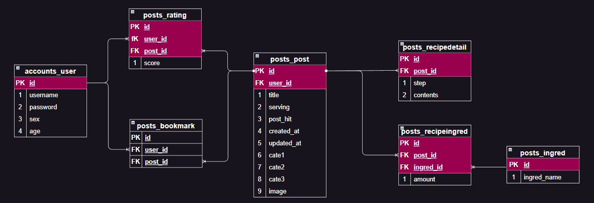

## 사이트 구축 
- 컴포넌트 구조

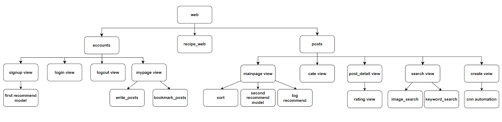

## 모델링
#### :one: 취향 테스트
사용자가 회원가입 후 선택한 음식 3가지 기반 취향을 분석해 레시피 맞춤 추천
- 10개의 레시피 중 3개를 선택
```python 
    food_choice = {
    '제육볶음': ['한식', '일상', '돼지고기'],
    '닭도리탕': ['한식', '술안주', '닭고기'],
    '된장찌개': ['한식', '원팬스피디', '콩견과류'],
    '비빔밥': ['한식', '다이어트', '채소'],
    '치킨커리': ['기타식', '일상', '닭고기'],
    '쌀국수': ['기타식', '일상', '면류'],
    '마라탕': ['기타식', '술안주', '채소'],
    '토마토파스타': ['양식', '원팬스피디', '면류'],
    '스테이크': ['양식', '일상', '소고기'],
    '초밥': ['일식', '일상', '해물'],
    }
```
- 선택한 3가지 음식의 카테고리 벡터와 유사도가 높은 레시피 추천 시스템 구현 
- 모델 및 구현은 posts - recommend_ml.py 참고

#### :two: 별점 기반 추천
현재 로그인한 유저가 남긴 별점을 기준으로 협업필터링을 진행해 모델을 통한 레시피 추천 
- 사용자가 게시글에 준 별점 데이터를 Pivot Table로 생성
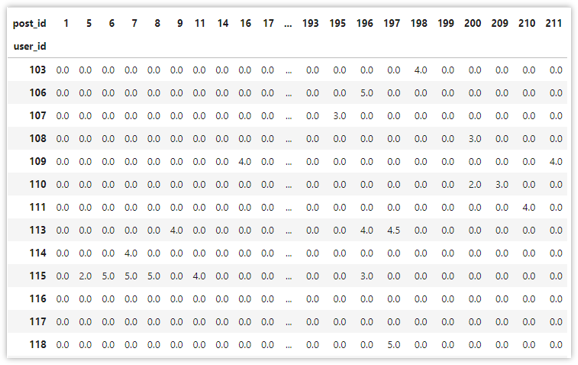
- 게시글간 유사도를 기반으로 평점 예측 모델 구축 
- 예측한 평점이 높은 게시글 추천 모델 구현 
- 예측 과정의 단계가 꼬이지 않도록 airflow를 이용하여 구현 
- airflow- dag - test_hj_score.py 참고


#### :three: CNN - 레시피 검색
이미지 딥러닝 모델을 학습시켜 사용자가 올린 이미지에 해당하는 음식 레시피를 도출
- CNN 이미지, 영상 데이터 인식을 위한 딥러닝 모델
- 40개의 음식에 대해 50개씩 데이터를 수집
- 학습 시간, 과적합 방지에 적합한 ResNet50 선택 
- 사진을 통해 정확도가 높은 5개의 음식이름을 추출하여 제목 포함 여부를 통해 레시피 post_id 추출
- 이미지 검색 후 레시피 호출 기능 구현 성공
- cnn_flask - app.py 참고
  
#### :four: CNN - 게시글 자동완성
음식 레시피를 도출 후 가장 별점이 높은 레시피의 카테고리, 재료를 자동으로 작성
- 위와 같은 모델 사용 
- 사진을 통해 정확도가 가장 높은 음식 이름 추출 
- 음식 이름이 제목에 들어간 레시피들 중 별점이 가장 높은 레시피 추출
- 추출된 레시피로 카테고리 및 재료 자동 완성 기능 구현
- cnn_flask - app.py 참고

## Log 데이터 수집 및 분석
#### :one: 로그데이터 수집
- Python Logging을 이용하여 로그데이터 수집 
- 상세보기, 검색, 즐겨찾기, 카테고리조회의 유저 행동에 대한 로그 축적 
- 각각을 detail, search, bookmark, cate1, cate2, cate3이라는 이름으로 조회시킴
- user, sex, age, post_id, post_title, postcate1,2,3, ip, modelname, asctime, search 등의 변수를 설정하여 로그 수집 형식 통일 
- 로그 수집 recipe_web- settings.py/ 로그데이터 logsfolder - json_log.log 참고

#### :two: 로그데이터 활용 
로그데이터 분석을 통해 시간대별/ 유저정보별 추천 레시피를 제공하자는 인사이트를 얻음

* 시간대별 인기레시피 
    * modulename이 detail인 것들 추출
    * 5-10시 아침, 10-16 점심. 16-23 저녁, 나머지는 새벽으로 시간대를 구분 
    * count함수를 통해 조회수를 집계한 후 시간대별로 수치가 높은 레시피 추출
    * posts - time_sort.py time_recommend 함수 참고

* 유저의 성별/나이대별 추천레시피
    * module name이 detail인 것들 추출
    * Age 변수로 나이대 뽑아내고 그룹화를 하여 post_id 고윳값 별 합계 집계
    * 유저와 같은 성별/나이대별 합계 수치가 높은 레시피 추출
    * posts - time_sort.py user_recommend 함수 참고   

* 인기 검색어 표시 
    * 로그데이터 중 modulename이 search인 것들 추출
    * ETL 구조를 활용하여 실시간으로 집계되고 시각화 되도록 구현 
    * Fluent와 OPENSEARCH를 이용하여 검색어 워드클라우드 대시보드를 제작함


## Airflow 
* 데이터 파이프라인 구현 
* 정확한 추천및 반 자동화를 위해 1시간 마다 진행 
* 별점 데이터 사용 기능에 자동 적용 
* Log 데이터 특성을 고려해 처리속도 저하방지를 해야한다고 판단하여 airflow로 구현 
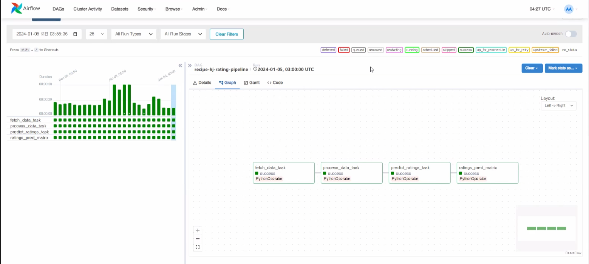


## Model Serving
Flask 기반 Serving Server 구현
- model inference 작업, Dajgno Web Server분리를 위해 Flask 사용  

## 스토리보드


###  SingUpView
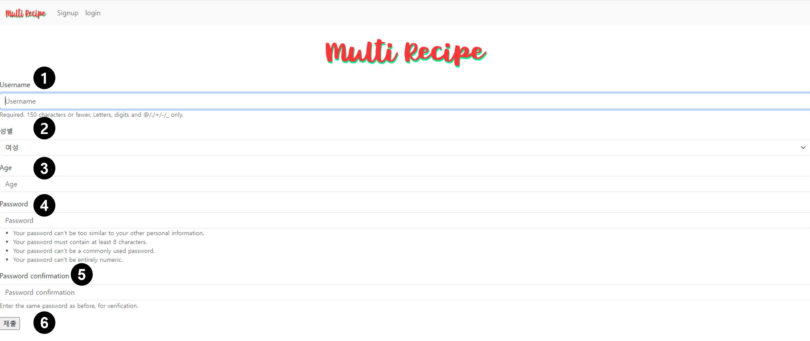
| No. | 항목             | 설명                                   |
| --- | ---------------- | -------------------------------------- |
| 1   | 사용자 이름      | 사용자 아이디를 넣는 항목              |
| 2   | 성별             | 사용자의 성별을 넣는 드롭박스           |
| 3   | 나이             | 사용자의 나이를 넣는 항목              |
| 4   | 비밀번호         | 사용자의 비밀번호를 넣는 항목          |
| 5   | 비밀번호 확인    | 작성한 비밀번호를 재확인하는 항목      |
| 6   | 제출 버튼        | 회원가입 항목을 모두 작성하고 제출하는 항목 |

### LoginView
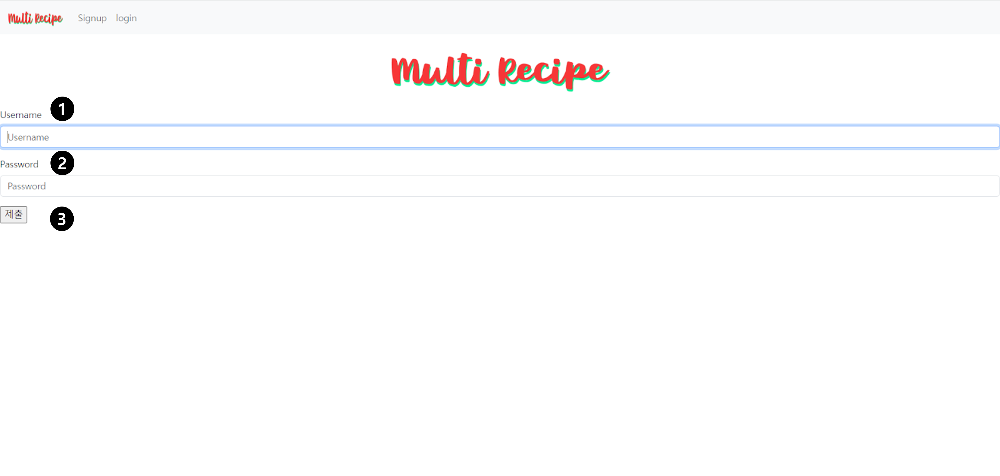
| No. | 항목             | 설명                              |
| --- | ---------------- | --------------------------------- |
| 1   | 사용자 이름      | 사용자 아이디를 넣는 항목         |
| 2   | 비밀번호         | 사용자의 비밀번호를 넣는 항목     |
| 3   | 제출 버튼        | 로그인 성공시 메인페이지로 이동   |

### RecommendView


| No. | 항목                 | 설명                                    |
| --- | -------------------- | --------------------------------------- |
| 1   | 음식 선택            | 음식을 선택하는 항목                    |
| 2   | 제출 버튼            | 선택한 음식을 제출하는 항목/ 추천페이지로 이동 |
| 3   | 페이지 정보 메시지   | 유저 이름과 추천레시피를 제공한다는 메세지 |
| 4   | 기능 소개 메시지     | 별점 기능을 사용을 유도하는 메시지        |

### MainView


| No. | 항목                | 설명                                             |
| --- | ------------------- | ------------------------------------------------ |
| 1   | 네브바              | 메인페이지로 이동하는 로고/카테고리별 페이지로 이동하는 드롭박스/클릭시 마이페이지로 이동하는 유저아이디 |
| 2   | 로고                | 홈페이지의 메인화면으로 이동하는 로고               |
| 3   | 게시글작성          | 클릭시 게시글 작성 페이지로 이동                  |
| 4   | 로그아웃            | 클릭시 로그아웃되며 로그인 페이지로 이동          |
| 5   | 마이페이지          | 클릭시 마이페이지로 이동                          |
| 6   | 키워드 검색         | 레시피 제목, 카테고리 키워도 포함 여부 검색     |
| 7   | 이미지 검색         | 이미지 기반 레시피 검색                          |
| 8   | 인기검색어          | 검색어 워드클라우드                               |
| 9   | 시간대별 레시피      | 시간대별 인기레시피 4개 배치                      |
| 10  | 유저정보 레시피      | 성별, 연령별 정보에 대한 인기레시피 4개 배치      |
| 11  | 유저추천 레시피      | 유저의 별점기반 추천 레시피 4개 배치            |
| 12  | 베스트 레시피        | 모든 레시피 배치                                 |
| 13  | 정렬                | 최신순, 조회순, 별점순으로 정렬된 모든 레시피   |
| 14  | 레시피 정보          | 레시피 사진, 제목, 날짜, 즐겨찾기 정보 / 제목 클릭시 상세보기 페이지로 이동        |  

### DetailView
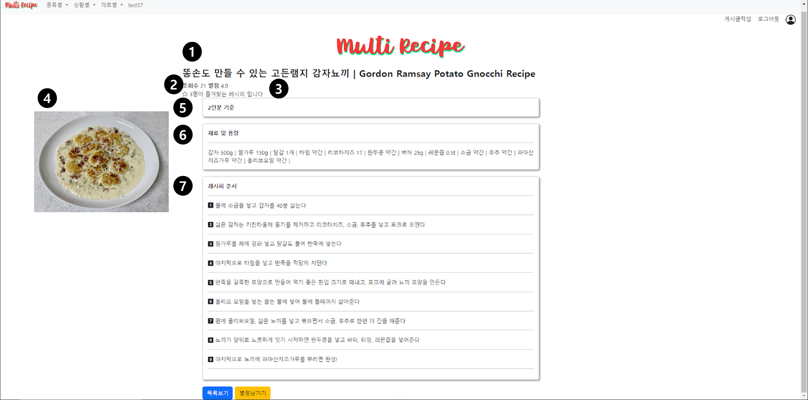
| No. | 항목            | 설명                                        |
| --- | --------------- | ------------------------------------------- |
| 1   | 제목            | 게시물의 제목을 보여주는 항목                |
| 2   | 조회수/별점     | 게시물의 조회수와 별점평균을 보여주는 항목   |
| 3   | 즐겨찾기        | 게시물의 즐겨찾기 여부를 보여주는 항목        |
| 4   | 사진            | 게시물의 사진을 보여주는 항목                |
| 5   | 인분            | 게시물의 인분을 보여주는 항목                |
| 6   | 재료 및 용량    | 게시물의 재료 및 용량을 보여주는 항목        |
| 7   | 레시피 순서     | 게시물의 레시피 순서를 보여주는 항목         |

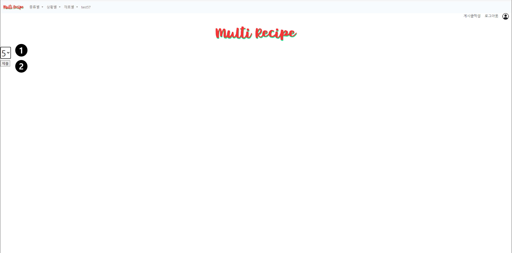
| No. | 항목         | 설명                                            |
| --- | ------------ | ----------------------------------------------- |
| 1   | 별점         | 별점을 선택할 수 있는 1~5까지의 드롭박스        |
| 2   | 제출 버튼    | 게시물에 대한 별점을 주고 게시물 페이지로 돌아오는 항목 |

### CreateView
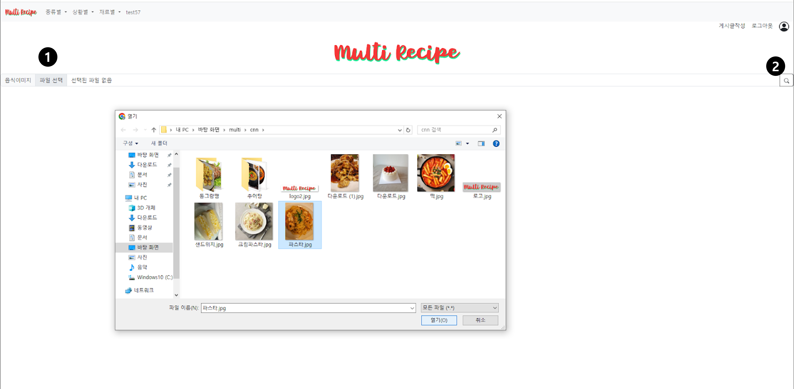
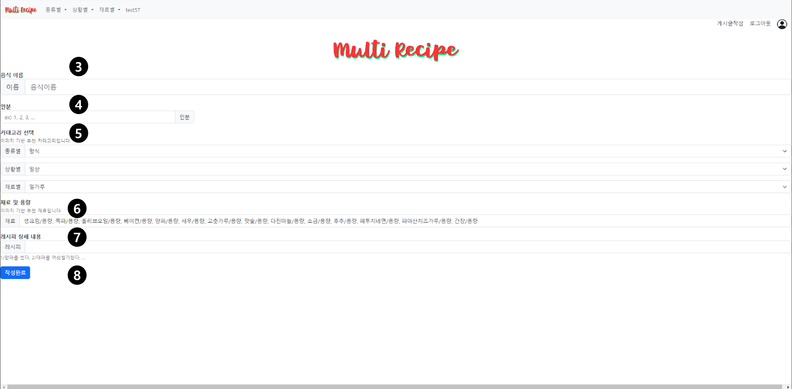
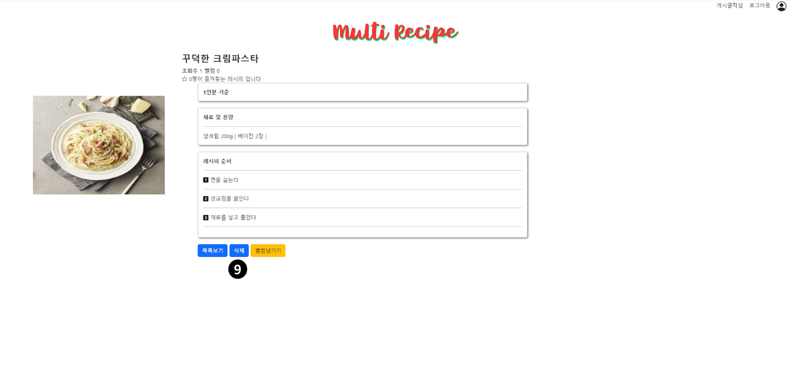
| No. | 항목               | 설명                                       |
| --- | ------------------ | ------------------------------------------ |
| 1   | 사진               | 음식 사진을 넣는 항목                       |
| 2   | 업로드 버튼        | 사진을 업로드하는 항목/ 게시글 자동완성 작성 페이지 이동 |
| 3   | 음식 이름           | 음식 이름을 넣는 항목                       |
| 4   | 인분               | 인분을 넣는 항목                           |
| 5   | 카테고리           | 카테고리를 넣는 드롭 박스/ 이미지 기반 추천 자동완성 |
| 6   | 재료 및 용량       | 재료를 넣는 항목 / 이미지 기반 추천 자동완성 |
| 7   | 레시피 상세 내용   | 레시피를 넣는 항목                         |
| 8   | 작성완료           | 작성 완료하여 업로드하는 항목/ 상세페이지로 이동 |
| 9   | 삭제               | 자신이 작성한 글에 한해 삭제하는 항목        |

### MypageView
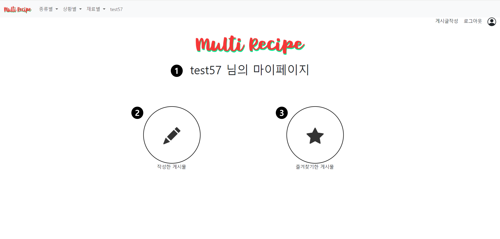
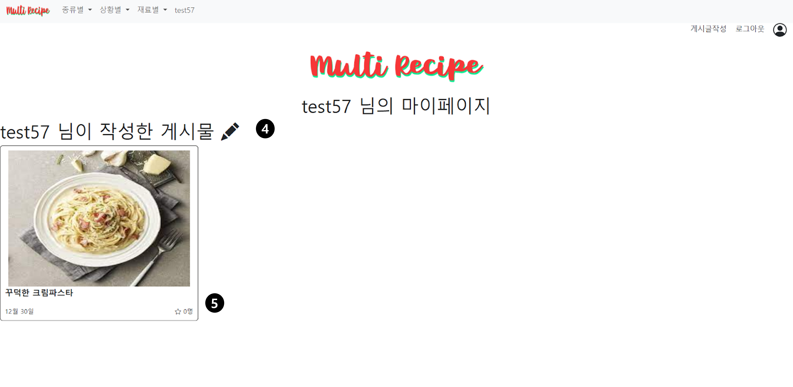
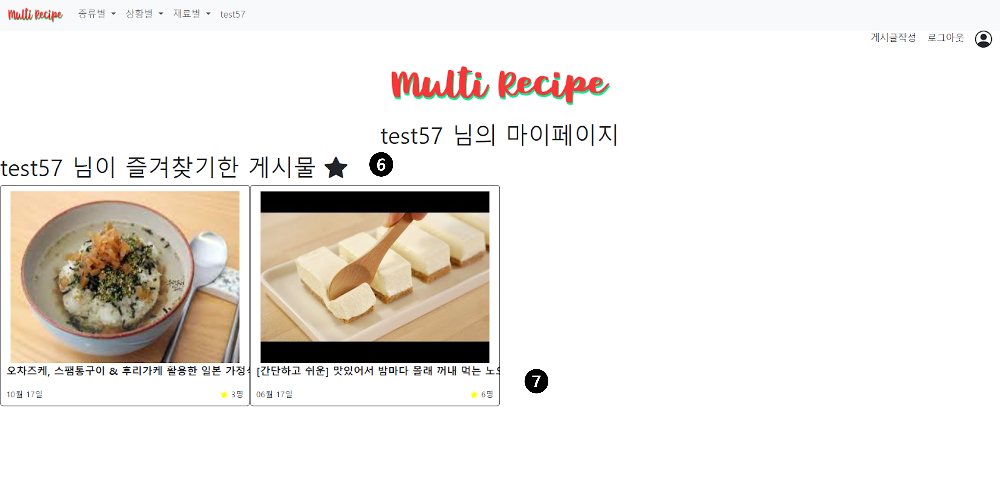
| No. | 항목                    | 설명                                    |
| --- | ----------------------- | --------------------------------------- |
| 1   | 페이지 정보 메시지      | 유저이름과 마이페이지 메시지              |
| 2   | 작성한 게시물          | 펜 아이콘 클릭시 작성한 게시물 페이지로 이동 |
| 3   | 즐겨찾기한 게시물      | 별 아이콘 클릭시 즐겨찾기한 게시물 페이지로 이동 |
| 4   | 페이지 정보 메시지      | 유저이름과 작성한 게시물 페이지 메시지   |
| 5   | 작성한 게시물 리스트   | 작성한 게시물을 최신순으로 정렬          |
| 6   | 페이지 정보 메시지      | 유저이름과 즐겨찾기한 게시물 페이지 메시지 |
| 7   | 즐겨찾기한 게시물 리스트 | 즐겨찾기한 게시물을 나열               |

### SearchView


| No. | 항목                 | 설명                                       |
| --- | -------------------- | ------------------------------------------ |
| 1   | 키워드 검색어        | 검색한 키워드를 보여주는 항목               |
| 2   | 키워드 검색 레시피   | 사진을 업로드하는 항목/ 게시글 자동완성 작성 페이지 이동 |
| 3   | 이미지 검색 레시피   | 음식 이름을 넣는 항목                      |

### CateView


| No. | 항목                   | 설명                                         |
| --- | ---------------------- | -------------------------------------------- |
| 1   | 종류별 세부 카테고리  | 종류별 카테고리 드롭박스                      |
| 2   | 상황별 세부 카테고리  | 상황별 카테고리 드롭박스                      |
| 3   | 재료별 세부 카테고리  | 재료별 카테고리 드롭박스                      |
| 4   | 카테고리 표시          | 카테고리 > 세부카테고리/ 현재 페이지에 대한 정보 제공 |

## 주요기능시연영상
### 취향 테스트 
[](https://www.youtube.com/watch?v=zopkfUbWDzM)

### 게시글 작성
[](https://www.youtube.com/watch?v=xud0JjsZFVo)

### 이미지 검색 기능 
[](https://www.youtube.com/watch?v=xcm74q47urk)
